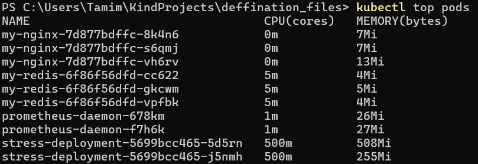
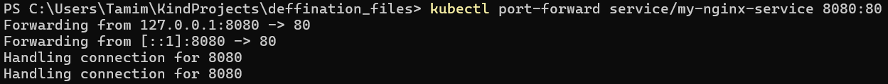
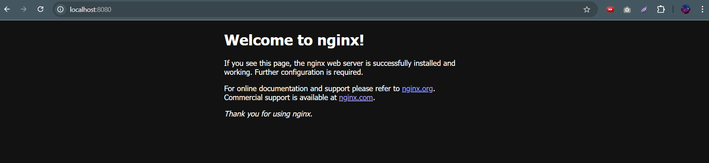

# Kubernetes Learning Journey With Kind Cluster

## Overview

This project represents my evolving Kubernetes journey, starting with a local kind cluster to explore key concepts and grow my skills. As a learner, I’m diving deeper into Kubernetes with much more to master, and I’ll be adding new experiments and updates regularly. This is part of my Kubernetes learning journey, and I'm excited to share my progress!

## Project Highlights

- **Kind Cluster**: Set up a local Kubernetes environment.
- **Deployments**: Launched nginx (frontend), redis (backend), and stress-ng (for CPU load testing).
- **Taints & Tolerations**: Ensured redis pods run only on a specific node using taints.
- **Node Affinity**: Pinned redis pods to nodes with `diskType=ssd`.
- **HPA**: Configured auto-scaling for the stress deployment when CPU exceeds 50%.
- **NodePort Service**:  Created a NodePort service to expose the nginx deployment and accessed it via port forwarding, as there is no external IP for a worker node in a local kind cluster.
- **Prometheus Monitoring**:  Deployed a Prometheus DaemonSet to monitor nodes, configured with tolerations to run on tainted nodes.

## Prerequisites

- kind (`go install sigs.k8s.io/kind@latest`)
- kubectl
- Docker
- Metrics Server (see setup below)

## Setup Instructions

1. **Create Kind Cluster**:

   ```bash
   kind create cluster --name demo
   ```

2. **Label and Taint Node**:

   ```bash
   kubectl label nodes kind-worker diskType=ssd
   kubectl taint nodes kind-worker type=Database:NoSchedule
   ```

3. **Install Metrics Server**:

   ```bash
   kubectl apply -f https://github.com/kubernetes-sigs/metrics-server/releases/latest/download/components.yaml
   ```

   Note: You may need to patch Metrics Server for kind (e.g., add `--kubelet-insecure-tls` flag). See Metrics Server docs.

4. **Apply Deployments**:

   ```bash
   kubectl create -f nginx-deployment-definition.yaml
   kubectl create -f redis-deployment-definition.yaml
   kubectl create -f stress-deployment-definition.yaml
   kubectl create -f stress-deployment-hpa.yaml
   ```

5. **Create and Expose Service**:

   ```bash
   kubectl create -f service.nodeport.definition.yaml
   kubectl port-forward service/my-nginx-service 8080:80
   ```

6. **Deploy Prometheus Monitoring**:

   ```bash
   kubectl create -f prometheus-daemon-definition.yaml
   ```

7. **Verify Setup**:

   - Check pod placement: `kubectl get pods -o wide`
   - Monitor CPU usage: `kubectl top pods`
   - Check HPA: `kubectl get hpa`
   - Verify service: Open `http://localhost:8080` in a browser (requires port-forwarding).

## Files

- `nginx-deployment-definition.yaml`: Deploys 3 nginx pods (frontend).
- `redis-deployment-definition.yaml`: Deploys 3 redis pods (backend) with tolerations and node affinity for SSD nodes.
- `stress-deployment-definition.yaml`: Deploys a stress-ng pod to simulate CPU load.
- `stress-deployment-hpa.yaml`: Configures HPA to scale stress deployment (1-2 replicas) when CPU usage exceeds 50%.
- `service.nodeport.definition.yaml`: Creates a NodePort service to expose the nginx deployment.
- `prometheus-daemon-definition.yaml`: Deploys a Prometheus DaemonSet to monitor nodes, with tolerations for tainted nodes.

## Demo

- **Pod Placement**: Redis pods run only on the `kind-worker` node due to taints and tolerations and node affinity.
- **HPA in Action**: The stress deployment scales to 2 replicas when CPU usage exceeds 50% (simulated via stress-ng).
- **Screenshots**:
  - `kubectl get pods -o wide`: Shows all pod placements.
    
  - `kubectl get hpa`: Shows scaling events.
    
  - `kubectl top pods`: Shows pod resource consumption. The stress-pod is using almost 2 cores. That is why the hpa has created 2 pods.
    
  - `kubectl port-forward`: output: Displays the port-forwarding process.
    
  - Nginx welcome page: Shows the nginx default page at `http://localhost:8080`.
    

## Future Plans

- Dive into cluster maintenance (e.g., upgrading Kubernetes, handling node failures).

#Kubernetes #DevOps #CloudNative #LearningTech #TechJourney
